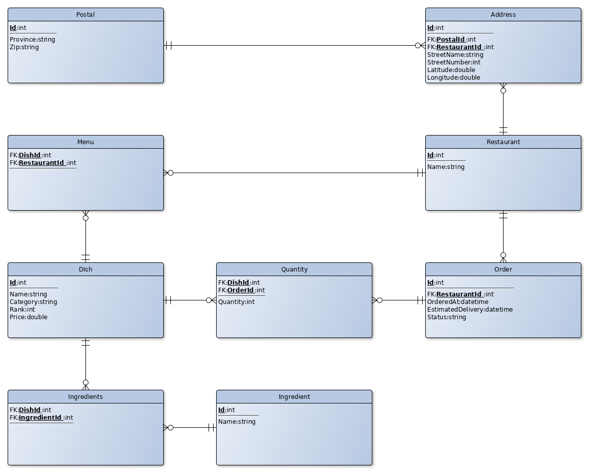

# Pizza Application Model

The Pizza Application is composed of two web services

- OrderService
- RestaurantService

Each service is responsible for their business domain, e.g. order service handle orders.

The restaurant service handles listing of restaurants, listing of restaurant specific menu and restaurant look-up based on syntactic ID
(given by the data base engine when the restaurant entity is persisted).

## Design of the solution

The solution is divided into the packages (with the name space *org.tempuri.pizza*):

- DTO (Data Transfer Objects - objects bridging JSON and internal structure representation)
- Store (Data store entities)
- WS (Web services)

There are some other packages as well (org.hibernate.dialect.*) that handles SQLite dialect (the database used is SQLite),
and functional (the interface for lambda expressions wasn't used in the solution, but it's there anyway).

Hibernate (framework) is used as the ORM for the solution, thus a Hibernate configuration file is needed and included in the solution.

Jersey (framework) is used for the Web services.

## Information model 

The information model is based on the interface given at (http://docs.apegrouppizzaappapi.apiary.io/#)

A number of relationships and entities are drived from the API, and constructed in the *store* package.
The model itself is illustrated by the following figure:

The functionality implemented is:

- List all restaurants
- List all dishes (menu) for a given restaurant
- Look-up restaurant based on ID

# Summary

This is a simple show case, written in Java, illustrating database store and web services applied to a simple interface.

You're welcome to study the solution and develop it further if you want.

Have fun!

 
